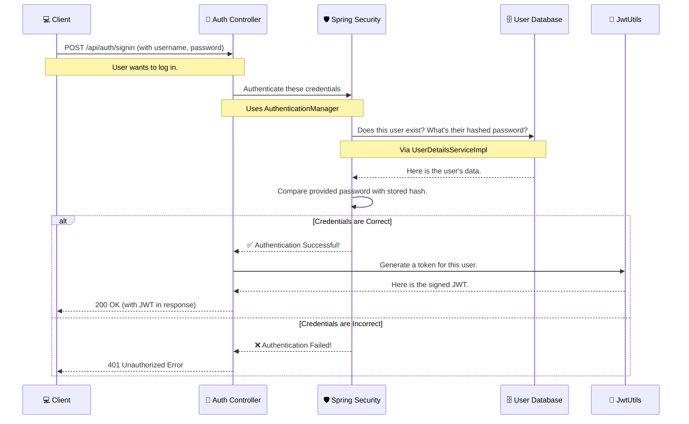
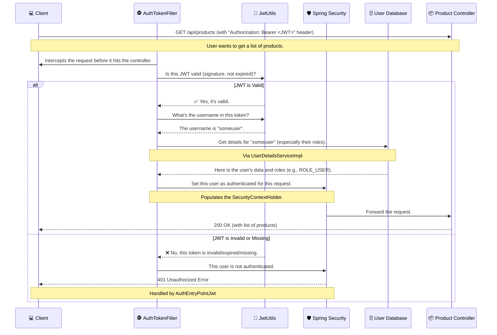

# How JWT Authentication Works in This Project

This document explains the complete flow of how JSON Web Token (JWT) security is implemented in this Spring Boot application. It's designed for beginners to understand the "how," "what," and "why" of each step.

## The Big Picture: What Are We Trying to Do?

Imagine a private club. To get in, you first go to the front desk, show your ID (username and password), and if it's valid, you get a special keycard (a JWT). Now, to enter any private room (a protected API endpoint), you don't need to show your ID every time. You just flash your keycard.

Our API works the same way:
1.  **Authentication (Logging In)**: The user proves who they are once with their credentials.
2.  **Token Issuance**: The server gives them a signed JWT (the keycard).
3.  **Authorization (Accessing Stuff)**: The user includes this JWT with every future request to prove they are authenticated and have permission to access the requested resource.

This process is **stateless**, which means our server doesn't need to keep a session open or remember who is logged in. It just needs to validate the JWT on each request.

---

## Flow 1: The Login Process (Authentication)

This is how a user gets their JWT "keycard". This happens when they send their username and password to the `/api/auth/signin` endpoint.

### Why This Works

-   **Security**: We never store or send passwords in plain text after registration. Spring Security uses the `BCryptPasswordEncoder` to compare the provided password against a securely hashed version in the database.
-   **Separation of Concerns**: The `AuthController` handles the HTTP request, `SpringSecurity` handles the complex logic of authentication, and `JwtUtils` is only responsible for creating the token.

---

## Flow 2: Accessing a Protected Resource (Authorization)

Once the user has their JWT, they can use it to access protected endpoints like `/api/products`.

### Why This Works

-   **Efficiency**: The server doesn't need to look up the user's password and validate it on every single request. It only needs to perform a quick cryptographic check on the JWT's signature.
-   **Centralized Logic**: The **`AuthTokenFilter`** acts as a gatekeeper for all protected endpoints. This means you don't have to repeat authentication logic in every controller. If the token is valid, the user is "in." If not, they are stopped at the gate.

---

## Key Files and Their Roles

| File | Role in Plain English |
| :--- | :--- |
| **`WebSecurityConfig.java`** | **The Rulebook**. It tells Spring Security which endpoints are public (like `/api/auth/signin`) and which are private. It also registers all the other security components. |
| **`AuthTokenFilter.java`** | **The Gatekeeper**. This filter intercepts every incoming request to check for a JWT, validate it, and establish the user's identity for that request. |
| **`JwtUtils.java`** | **The Keymaker**. A helper class that is an expert at one thing: creating and validating JWTs. |
| **`UserDetailsServiceImpl.java`** | **The Librarian**. Connects Spring Security to your user database. When asked for a user by username, it looks them up in the database and returns their details. |
| **`AuthEntryPointJwt.java`** | **The Bouncer**. If an unauthenticated user tries to access a private resource, this class catches the error and sends back a clean `401 Unauthorized` error. |
| **`AuthUtil.java`** | **The Information Desk**. A simple helper for your controllers to easily ask, "Who is the user that made this request?" |
